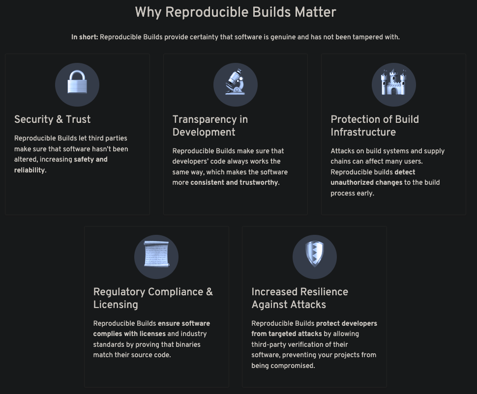
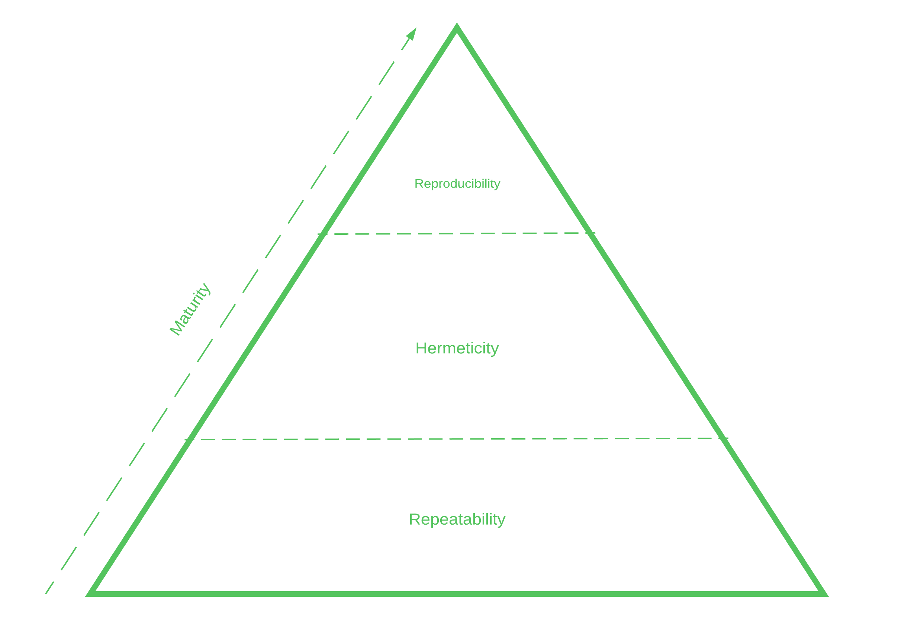
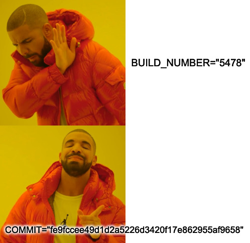
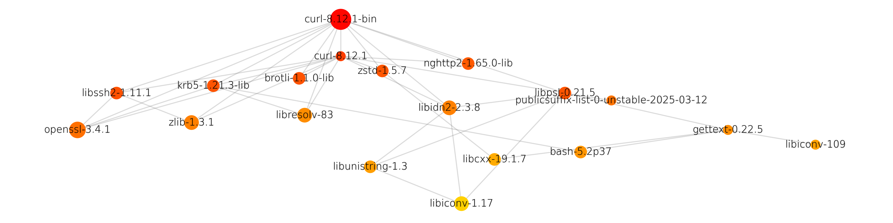

+++
title = "Rethinking the Building Blocks of Technology"
outputs = ["Reveal"]
+++



## Rethinking the Building Blocks of Technology

{}
Hi there, before we start my talk I'd like to acknowledge a range of people that have enabled me to be here today
and presenting to your fine folk.

To the /NEW team in it's entirety, thank you very much for all of the hard work that has gone into this event

Even though she's not here to hear it, I want to thank my wife for her continual support and enabling me to pursuit
some of the rabbit-holes I'll be talking to you about today.

Finally, I'd like to acknowledge the traditional custodians of this land, the Awabakal people and pay respects to
elders, past, present and emerging
{}

---

### $ whoami 🧑‍💻️

- Lead Threat Management & Technical Assurance Operations at nib Group
- Developer turned Cybersecurity Addict
- Homelab enthusiast (automation, building, exploring)

{}
Hi, my name is Jay, my current role is the threat management and technical assurance operations lead at nib Group.
I've been working in the Cybersecurity for the last 8 years, but only recently started moving into a people leadership
role.

My team works primarily in a line 2 position in our organisation - if you haven't come across this term before it indicates our primary role is
to guide, govern and enable the line 1 teams - also known as operational teams.

Prior to working in this role I was a developer slinging C# for a local company that engineered, designed, built and delivered commercial and industrial sheds.

In my spare time I co-organise a local meetup: NCSG or Newcastle Cybersecurity Group, we normally run on the last Wednesday of each month
with only a handful of exceptions and would always be excited to see new faces if your are interested in Cybersecurity generally.
{}

---

Do feel free to interrupt with questions! ✋

{}
Please do feel free to interrupt with questions, we may need to take some questions to after the talk
where it may be more suitable, but I do want this to be engaging rather than just me talking about
a niche technical space that I'm captivated by

Given you are here today, I hope I can provide you some insights and inspiration in the field of
reproducibility in technology

One last note in-case you do ask a question, my first nickname within a professional setting was "bugs", not because insects are awesome, but
because Bugs Bunny can dig a lot of rabbit-holes, that was my speciality.

I will do my best to depth limit not because I don't want to explore a question, but because it otherwise may come the rest of the talk
{}

---

# 🔮

> To what extent should one trust a statement that a program is free of Trojan horses?

{}
Ken Thompson's 1974 paper entitled "Reflections on Trusting Trust" was quite visionary; he asked
this very question and described a method in which one could conceptually backdoor a c
compiler in the bootstrapping process of the compiler.

This would allow for even a clean source code copy of the compiler itself to be infected by a malicious compiler despite the
source code never containing any malicious code

We won't be exploring as deeply as the paper explored today, however you would be able to apply concepts
discussed today to defend against just a risk if required
{}

---

### Agenda

- Core concepts
- Benefits, costs and core themes to create reproducible builds
- Some examples from the wild
- Opportunities for adoption

{}
Today we'll talk about reproducible builds! I intend to make this talk accessible where possible
to a range of technical ability; so if you've come along and are not sure if this'll be your
jam, I hope I can present something of value to you today

The first stop in the talk will be about the core concepts backing today's talk:
while this will be rather dry to people whom have explored or implemented reproducibility,
I hope it'll position anyone who is new to the space with a good understanding to move forward with

Then we'll talk about what reproducible builds mean for a builder and consumer, what pain or gain
comes from taking the proverbial plunge as well as what risks and issues are created or resolved by reproducible builds

Lastly we'll explore at a high level some features or capabilities in technology you may be
utilising already that enables your reproducibility journey

{}

---



{}
I don't want you to take away from this a level of fear, uncertainty or doubt as I do feel the cybersecurity
domain as a profession can commonly make matters seem that they are worse than they are at times.

All of the topics I cover today should be balanced with user requirements, and when I say users I mean
both the builder as well as the consumer: not all solutions _must_ be reproducible but the
application of these concepts should enable all users to be able to not just trust but verify
an output at any time
{}

---

Hands up who... 👀

{}
I do feel like every second tech talk will ask the audience for a show of hands regarding the topic
being talked about, so I figured I'd be no different.

If you've explored or implemented this space before, or read Reflections on Trusting Trust would you
mind raising your hand?

{}

---

{}
But before I start talking about definitions, let's chat about why you should care about if a build is reproducible.
Please note when I say build, I do not exclusively mean the output of a compilation process but any process that
takes some source code and supporting artefacts and is presented to a consumer.

Some examples of builds might be the very one Ken suggested: a compiler or other low-level binary

Or it could include an electron application that a consumer uses on their desktop computer: Slack, Discord or alike: these
programs contain a mixture of binary and non-binary content that is utilised in the end product.

{}

---



{}
The reproducible-builds.org website provides a great outline on the why of our topic today. My primary focus will be on
the direct security and threat related elements of this slide today, but I want to recognise the opportunity that exists
in the legal, risk and compliance domains when utilising reproducible builds.

We are currently witnessing a rise in supply chain attacks across the technical industries we work.

These attacks may be partially or full mitigated by reproducible builds.

Not all attacks on supply chains can be stopped in this way but as threat actors seek to gain footholds in build infrastructure in order to ensure
a higher level of stealth and capability in their campaigns, we need to take the fight to these locations.

Hardened build infrastructure is great, using a SaaS platform for your builds reduces your overhead in the provision of services, but we should
reflect on how much can we trust either our own or a provider's infrastructure, and what if we were to build better verification mechanisms directly
into our release process

{}

---

{}
I'd like you to conceptualise the reproducible builds as an outcome that is dependent on the
completion of other milestones

This breaks up the overall goal we might have of reproducible builds into more reasonable segments

A large portion of technical industries have of-course already completed a fair segment of
this visual conceptualisation as just application of reasonable paths to achieve their objectives

{}

---



## Repeatability

{}
The foundation of repeatability likely doesn't need a deep introduction; we need to be able to do
our task many times without too much pain

In a lot of cases this will be defined as build files, shell scripts, Docker or OCI definitions,
configuration as code snippets or a command option that presents itself through your language of choice

Take example of that as your npm or yarn builds, rake build, dotnet build, gradle build, cargo build,
go build and so forth

{}

---



## Hermeticity

{}
Hermeticity is defined superbly by the Bazel docs, so I'm going to read this verbatim:

"When given the same input source code and product configuration, a hermetic build system always returns the same output by isolating the build from changes to the host system" ([ref](https://bazel.build/basics/hermeticity))

End quote

Source code within hermetic settings should always be validated to ensure that no changes have occurred.
Git and other version control systems enable this by providing explicit hash references to work with,
further to this, where a source provides a validation mechanism to ensure the content is also unmodified,
this should be utilised also.

Hermetic systems will generally treat tools as source code also; downloading and validating that the tool
is exactly what the target build requires

{}

---



## Reproducibility

{}
This time reproducible-builds.org lends us the definition:

"A build is reproducible if given the same source code, build environment and build instructions, any party can recreate bit-by-bit identical copies of all specified artifacts" ([ref](https://reproducible-builds.org/docs/definition/))

End quote

You might have noted that the definition of hermetic builds bordered this definition rather closely; and generally yes, once you achieve a hermetic build, you are extremely close to a reproducible build

The difference between these two concepts is that reproducible builds are the subset of hermetic builds that always output a bitwise identical output. There's reasons why a hermetic build may not be reproducible, and we'll
cover those a little later in the talk.

{}

---



## Verified Reproducibility

{}

Finally we've got the final boss of build concepts. Generally the distinction of a verified reproducible build is not made over it's non-verified counterpart but I thought this
was a really neat addition that is defined in the SLSA initiative driven by both industry leaders as well as the Open Source Security Foundation or OpenSSF.

SLSA (or Supply-chain Levels for Software Artifacts) definition of Reproducible Builds extends past just the previous definition to add:

"using two or more independent build platforms to corroborate the provenance of a build. In this way, one can create an overall platform that is more trustworthy than any of the individual components" ([ref](https://slsa.dev/spec/v1.0/faq#q-what-about-reproducible-builds))

{}

---



## Are We There Yet?

{}
So based on what we now understand, surely this just isn't difficult right? We commonly build most of the software or infrastructure we work with via code that only changes when
we change it.

Industry standard patterns such as the adoption of containerisation has helped greatly in shifting build processes away from being machine
dependent, but don't enforce strong opinions that would achieve the last steps of reproducibility.

So let's talk about what are the key issues that commonly stop projects from being reproducible

{}

---



{}
During the talk I'll keep references or use-cases scoped to more of a simple construct to visualise; a single programming project where possible.

The ability to build full systems in the same manner exists, but would mean we'd be looking at examples far too complex or large to
be reasonable to speak to right now

As a conceptualisation however; what you're seeing is my personal workstation viewed as a build graph. It is running most standard
fare tools such as a:

- browser
- media player
- terminal
- code environment
  and so forth
  {}

---



Let's talk about some of the key challenges now

---

## Environmental Factors

{}
Build systems can commonly view the embedding of build environment values as a feature which helps anyone in the future understand where a file has come from, when it was created and more

This makes sense for a number of reasons, but means a consumer if they attempt to validate the output, they may not be able to achieve the same outcome.

Solutions such as [Debian's Build Info Files spec](https://wiki.debian.org/ReproducibleBuilds/BuildinfoFiles) help codify what should be defined within local environments generally,
but never advocates for embedding of non-deterministic values in an output

If there is a need to embed information in an output, option such as source reference IDs are always the better solution: these describe what the original source was that was used to
build the output. This is an immediate link back to a starting space if you need this information to troubleshoot and isn't an arbitrary reference such as a build number from your
build pipeline that itself, may not be deterministic in state.
{}

---



## Timestamps

{}

Timestamps, and the encoding of timestamps in output artefacts is another major issue within the reproducibility; where possible, the best solution to timestamps being
present within pipelines is to utilise the `SOURCE_DATE_EPOCH` normalised form: this is the reported timestamp associated with the version control systems and should enable any other
builder to re-use the same values where possible.

{}

---



## Randomness

{}

Randomness being introduced to builds is an obvious bad choice if we're targeting reproducibility. One of the better examples of this was dotnet's [MVD](https://learn.microsoft.com/en-us/dotnet/api/system.reflection.module.moduleversionid) (or module, version ID)
which introduced both the module and version into a compiled artefacts, leading to unique outputs in most default cases of a dotnet build prior to about 2018.

Around 2018 the deterministic compiler flag was changed to default true which helps alleviate this problem from a dotnet perspective, but dotnet
is not an isolated case where practices that have existed for long periods of time, are now understood to introduce problems in reproducible builds
and by extension introduce uncertainty in software supply chains.

{}

---



## Build Step Ordering

{}

A lot of build tools may have determinism tied to the order of operations

As a very basic example, if your build is running in a POSIX compliant environment and utilises the `readdir` function either directly or by a tooling step you may be inviting a pseudo-randomness into your build process

You can still use function such as `readdir`, you just need to consider the stability of the output with some level of post-processing

{}

---



## Parallelism

{}

This issue is generally tied to the configuration of options in relation to a single build node and generally
is bound to compiled artefacts as the final output may be deterministic based on parsed code ordering.

Parallelism is ironically enough actually one of the major benefits of build chains that ensure all dependencies are reproducible. So the takeaway from parallelism is to validate that
the ordering of events won't cause non-deterministic output in the case you may be working with.

{}

---



## Metadata Stripping

{}

Some build tools are nice enough to include in their outputs content related to what version of a tool created the output, where to find those tools and more.

Classic examples of files that love hoarding metadata include images, pdfs and word processing documents.

Assuming you are using pinned inputs on build tools themselves, it is conceivable that some fields could be kept where suitable.

but to ensure a higher likelihood that a consumer can reproduce the outcome you are able to achieve, the metadata on any files should be stripped.

There's some pretty good tools to achieve this such as `stabilise` from Google and enables those optional fields if required ([ref](https://github.com/google/oss-rebuild/tree/ca63fb9d0f009e392a115fb5a18182866e0adbab/cmd/stabilise))

Some build systems will include explicit hooks or steps that apply a strip functionality across all content to ensure that both inputs and outputs cannot be impacted by metadata elements

{}

---



## Metadata Stripping

{}

As a simple observation, last night we ran the May edition of Newcastle Cybersecurity Group and I downloaded the menu of the Pizza
place we get pizza from to ensure we could cater for a dietary requirement.

Now, I know a pizza place doesn't need to consider reproducibility in their day to day, but that pdf had landed next to my slide
content and taunted me as I reviewed and validated today's content.

Any guesses for how many redundant lines of metadata content that file held?

25 based on my count - I'm talking when the file was created, what was it created by, what was the original document ID and so forth

This is fine for a Pizza shop, but if you are building and compiling documentation artefacts with your outputs - they really need
to be stripped of metadata if you are seeking reproducibility

{}

---

## Dependencies As Potential Risk

{}
"Dependencies As Potential Risk" may be a concern I think a fair portion of people will be able to relate to. But the solution is not to write it all yourself.

Most packaging systems, even if they offer loose or range definitions for the install candidates will honour a lockfile when it exists without attempting to update the dependencies - use lockfiles where you can to alleviate possible non-determinism

Dependencies within the programming industry are generally mature in their approach to management, most commonly it's legacy or aging approaches to dependency management that won't use a lockfile or don't have mechanisms that enable deterministic outcomes

{}

---

{}
It may or may not surprise you, how many transitive dependencies some software may have when you're able to look at the more complete picture of the end-to-end chain of dependencies required to build it.

This goes without suggesting that the displayed example of curl is a more simple example and completely ignores the fact we require a minimal system running to even build those dependencies: so the realistic graph
to describe a full transitive dependency chain when you go down the rabbit-hole is much larger
{}

---

## Documentation as a Benefit

{}
Log4j is excellent software, unfortunately in 2021 it was subject to an issue that enabled a pretty easy to exploit remote code execution bug.

- Did anyone have the fun of responding to this bug when this was first identified?
- Did anyone find it was easy to identify all software utilising log4j as a transitive dependency?

Generally because software is distributed without clear provenance of it's dependencies, it may take weeks or months to identify fringe cases such as log4j. Even in proprietary settings we can look to equip our consumers
with better visibility of the transitive dependencies.

{}

---



## Are We There Yet (again)?

{}
At this point we've discussed what it means for a build to be reproducible, we've skimmed across some of the key elements required to achieve reproducible builds but have barely touched on the
opportunities that exist for you to possibly adopt reproducible build techniques

While the previous slide suggested a real-life example of the benefits of reproducibility, it was by proxy of the
emergent attributes of reproducible software and not because the output provided was bit-for-bit the same as
the source code

Let's look at another example of where the application of reproducible builds might have helped

{}

---



{}

Solarwinds was a watershed moment in the consideration industry was applying to reproducible builds and generally SDLC health overall.

I don't say that to discredit the efforts of significant and prolific projects such as
the TOR project, Debian, openSUSE and others had made to this point. But it was one of the most notable breaches in all history that showed that
adversarial activity was going after software that underpinned organisations around the globe.

Running through a quick synopsis of this for anyone not familiar:

In Sep 2019 APT group APT29 or Cosy Bear gain access to SolarWinds internal systems.

{}

---



{}

From Oct 2019 to Feb 2020: Attackers perform reconnaissance and trial runs using test code in SolarWinds' Orion build environment.

Mar 2020: Attackers insert a backdoor (later dubbed SUNBURST) into updates

From Mar to Jun 2020: Malicious updates were downloaded and installed by organisations

Dec 2020: FireEye discovers and discloses a major breach involving theft of red team tools

Dec 2020: U.S. Cybersecurity and Infrastructure Security Agency (CISA) issues emergency directives to disconnect affected Orion instances

{}

---



{}

Since the identification and response to this event, Solarwinds have
moved to adopt not only verified reproducible builds, deploying multiple
build pipelines to validate that outputs of builds have not been tampered with.

Solarwinds also created a Secure by Design resource centre that assists
the industry in better understanding the possible threats that exist to
software supply chains, as well as defences they can utilise to mitigate risk

{}

---



{}

The attack on XZ is a fascinating one, that leaves us with a real murky question of if doing all of these techniques can still help
us avoid software supply chain exploitation.

For anyone not familiar with the XZ attack, an attacker social engineered their way into the project and over the course of 2022 to 2024
slowly built a backdoor capability into a dependency of openSSH leading to an ability to remotely access impacted machines.

The hard truth here is that the author knew that most downstream builders of XZ utilised the published release files from github rather than using
the source code directly. This allowed the attacker to better hide their attack knowing that it was much less likely someone might identify the added flaw.

If a consumer was referencing the source code within `github` this attack would have been foiled.

{}

---



## Opportunities For Adoption

{}

Depth limiting now, let's chat about opportunities that exist for adoption of reproducible builds within a few common tech domains

{}

---



## Build Systems

{}
Bazel and Nix are the fore-runners of build systems that approach the build process as reproducible first; it is not a complete
free ride when considering either as both have a steep learning curve and both can still build non-deterministic outputs given
the right massaging

Please note that I'm not saying that other build systems do not enable reproducible builds, I'm simply noting what known leaders in
the space exist. There is a range of options that may be built into your current build system that better enables a reproducible environment
{}

---



## Languages

{}
I'll talk to the node side of the JS and TS ecosystem, but am aware we could talk about inline javascript examples also.

Within the node ecosystem, lockfiles are generally a great solution to ensuring upstream dependencies are adherent to
reproducible concepts, we might not be able to always ensure the dependency itself is ensuring reproducibility, but
is still a step in the right direction.

It does make sense sometimes to utilise wildcard, range or loose dependency requirements in a range of situations, it is
up to you to determine how and if the benefits of these features are worth the risk of potential supply chain attacks.
{}

---



## Languages

{}
The go.sum file and `go mod vendor` commands are your friends. Additionally ensuring the the GOOS and GOARCH environmental variables
are set consistently will help ensure better alignment to determinism
{}

---



## Languages

{}
Cargo.lock is the easiest answer - noting that the same suggestion as golang applies to ensuring consistent language versions are used where possible
{}

---



## Technologies

{}
Where possible, avoid loose tag references, digest hash references can be utilised to avoid potential image changes upstream that
could lead to increased risk in your application or platform

The docker best practices guide within the build documentation is rather on-the-money in suggesting

- multi-stage builds
- explicit upstream tags for source images

[ref](https://docs.docker.com/build/building/best-practices/)
{}

---



{}

At this point, we've covered the core concepts, some real life example and some possible avenues to consider assessing to build more
resilient and trustworthy systems. I recognise attempting to describe some of the common issues with build infrastructure, real examples
and common mitigations or responses may have been a lot to cover today

I very much appreciate your time today and hope I was able to expose you to a space that is often
overlooked but increasingly important in ensuring the foundations of technology we utilise day-today.

I am extremely keen to discuss any of this space at any time if you have more questions - noting this is a passion space and tangentially
work related and not my full time role. Do feel free to add me on LinkedIn!

{}

---



Thank you for listening to my talk!

